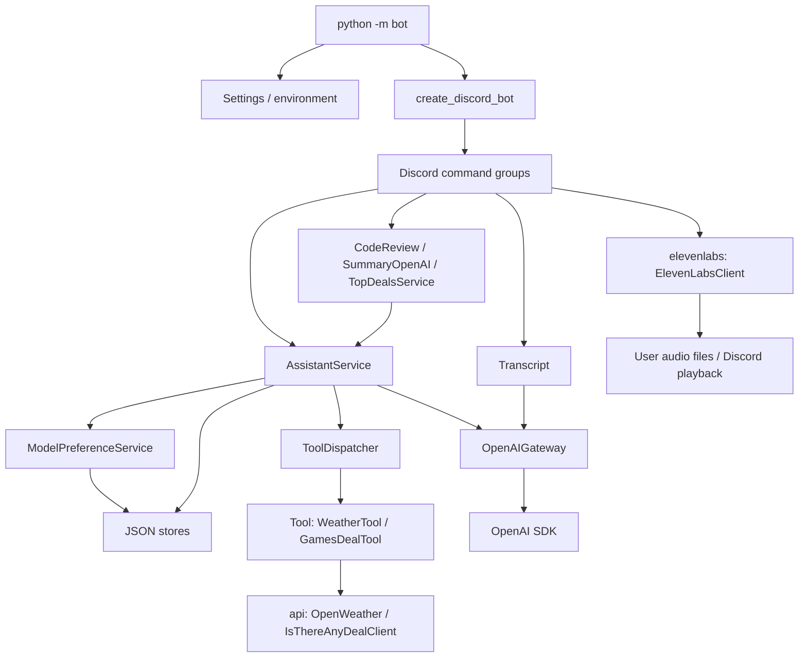

# Discord AI Bot

A Python 3.10+ Discord bot built with Pycord, OpenAI, and ElevenLabs. It answers
questions, reviews code, summarizes channel history, finds game deals and weather,
and transcribes or reads audio aloud.

## Features and examples

| Command | Example / behavior |
| --- | --- |
| `/assistant ask` | `question: What is the weather in Copenhagen, DK?` — conversational answers with weather and game-deal tools. |
| `/assistant clear_conversation` | Delete your active assistant conversation and its local reference. |
| `/assistant deals` | Fetch and rank three Steam deals for Denmark. The current preset uses an 80% discount filter. |
| `/assistant model` | List supported models available to the configured OpenAI account. |
| `/assistant select_model` | Save a `model_id` and `reasoning_level` from that list. |
| `/assistant show_my_model` | Show your saved selection or the configured default. |
| `/technical code_review` | `language: python`, `code: def add(a, b): return a + b` — request a review without adding it to assistant history. |
| `/technical token_report` | Administrator-only input/output token totals per user for the last 24 hours. |
| `/general summarize` | `start: 2026-08-30`, `end: 2026-08-31`, `channel_name: general` — summarize accessible channel history. |
| `/general reminder` | `seconds: 60`, `message: Check the build` — send a reminder by DM. |
| `/general hello`, `/help` | Greet the bot or list registered commands. |
| `/voice_assistant upload_mp3` | Attach an MP3 to transcribe and save it. |
| `/voice_assistant list_transcripts`, `/voice_assistant get_transcript` | List your saved transcripts or receive one by DM. |
| `/voice_assistant join`, `/voice_assistant leave` | Connect or disconnect the bot from voice. |
| `/voice_assistant eleven_labs`, `/voice_assistant play_transcript` | Speak supplied text or a saved transcript in your voice channel. |

Summary timestamps without a timezone use UTC. A date-only end includes that
whole day; select a past date, since future ranges are rejected. Long responses
are split into messages of at most 2,000 characters.

## Setup

Create a Discord application and bot, enable its **Message Content Intent**, and
invite it to your server with the `bot` and `applications.commands` scopes.
Grant View Channel, Read Message History, Send Messages, Embed Links, and Attach
Files where needed; voice playback also needs Connect and Speak. Channel summaries
check the invoking member's access before collecting messages.

From the repository root on Windows:

```powershell
py -m venv .venv
.\.venv\Scripts\Activate.ps1
python -m pip install -e ".[dev]"
Copy-Item .env.example .env
```

On Linux/macOS:

```bash
python3 -m venv .venv
source .venv/bin/activate
python -m pip install -e '.[dev]'
cp .env.example .env
```

Fill in `.env`, then run `python -m bot`. Required values are `TOKEN` (the Discord
bot token), `OPENAI_API_KEY`, and `GUILD_IDS` (comma-separated server IDs). Voice
playback requires an FFmpeg executable on `PATH`; the Python install includes
Pycord's voice dependencies. No provider keys or Discord connection are needed
to run tests.

## Configuration

Settings are loaded once at startup. Existing process environment variables take
precedence over `.env`. Blank optional values use their defaults.

| Variable | Default / purpose |
| --- | --- |
| `TOKEN`, `OPENAI_API_KEY`, `GUILD_IDS` | Required; startup fails clearly if absent or malformed. |
| `ELEVENLABS_API_KEY` | Optional; enables text-to-speech. |
| `ITAD_API_KEY` | Optional; enables IsThereAnyDeal game deals. |
| `OPENWEATHER_API_KEY` | Optional; enables weather and geocoding. |
| `OPENAI_MODEL` | Repository default: `gpt-5.6-luna`. Must appear in `src/bot/openai_models.py` and be accessible to your account. |
| `OPENAI_REASONING_LEVEL` | `medium`; must be supported by the selected model. |
| `DATA_DIR` | `data`, relative to the working directory. |
| `SUMMARY_MAX_DAYS` | `7` |
| `SUMMARY_MAX_MESSAGES` | `1000` |
| `SUMMARY_MAX_CHARACTERS` | `50000` |
| `UPLOAD_MAX_BYTES` | `10485760` (10 MiB) |
| `TTS_MAX_CHARACTERS` | `5000`, including saved transcripts read aloud. |
| `MAX_TOOL_CALLS` | `5`, across the entire response chain. |

Numeric limits must be positive. Missing optional keys produce startup warnings
and a clear error when that feature is used; other commands remain available.
The model allowlist is application configuration, not a promise of account access.

## Architecture



`src/bot/main.py` constructs and injects services. Commands handle Discord
interactions and permissions; workflows build prompts; orchestration handles
conversation recovery, model choices, usage attribution, and bounded tool loops.
SDK response/request types, typed dictionaries, and validated external objects
replace unstructured `Any` annotations. The OpenAI boundary follows the
[official Python SDK documentation](https://developers.openai.com/api/reference/python).

All package directories use lowercase names, including `api`, `openai`,
`elevenlabs`, `settings`, and `tool_calls`. HTTP tools use 15-second timeouts and
run synchronous provider calls through `asyncio.to_thread` to keep Discord
responsive. OpenAI calls are asynchronous; ElevenLabs stream consumption and file
writing run in worker threads during playback.

## Errors, security, and design decisions

Expected failures derive from `ApplicationError`: `InvalidInput`, `AccessDenied`,
`ResourceNotFound`, and `ExternalServiceUnavailable`. Configuration, missing
optional features, and tool-call limits have specialized subclasses. The Discord
error handler supports both initial and deferred replies. Tool failures become
safe function outputs so the assistant can explain them. Provider exceptions are
chained for debugging, while application logs record operation and exception type
without raw provider bodies, API-key URLs, or user prompts.

Secrets are excluded from settings representations and `.env` is ignored by Git.
Messages disable mentions by default, including AI-generated content. Code reviews
analyze submitted text; they do not execute it. Only registered weather/deal tools
can run, with runtime argument checks and a total tool-call limit.

Summaries check member permissions, cap date ranges/message counts/characters,
and do not join assistant history. Code reviews and deal rankings also use
stateless requests. Here, *stateless* means no conversation-history chaining;
it does not disable provider-side storage. Prompts, code, selected channel
messages, or audio are sent to the provider needed for that command.

Conversation references, model preferences, and token records are stored in JSON
under `DATA_DIR`. Conversations and preferences are keyed by Discord user (and
conversation workflow), so an assistant conversation can span servers. Uploaded
audio, transcripts, and generated speech are scoped to
`DATA_DIR/guilds/<guild_id>/users/<user_id>/`; transcript requests use basenames
within the caller's directory. Files and usage records have no automatic retention
cleanup. The 24-hour token report filters records rather than deleting them.

JSON storage is intended for one bot process: it has no cross-process locking,
encryption, or database transactions. Protect and back up `DATA_DIR`; use a database
before running multiple instances. Reminders live in memory and are lost on restart.
Command-level limits bound individual requests, not total account spending or disk
usage. Most successful command replies are visible in their Discord channel.

## Tests and code quality

```bash
python -m pytest
python -m ruff check .
python -m black --check .
python -m mypy src
```

Use `python -m ruff check . --fix` and `python -m black .` to apply supported
lint fixes and formatting. Mypy checks every application module, rejecting
untyped definitions/calls, bare generics, and accidental `Any` returns. One
documented suppression covers Pycord's unannotated `Bot` constructor.

Tests mock Discord and provider operations and use temporary storage. They cover
conversation recovery, tool execution and limits, model selection, token accounting,
summaries, message splitting, voice paths, malformed input, and safe error handling.
GitHub Actions runs Ruff, Black, and Mypy plus pytest on Linux and Windows with
Python 3.10 and 3.14. Live credentials, provider availability, FFmpeg, and voice
playback still require a manual integration check.

## Refactoring journey

The bot grew from SDK-oriented commands into separate command, workflow,
orchestration, provider, and storage modules. This pass retains that structure and
standardizes its interfaces: `Tool`, `IsThereAnyDealClient`,
`AssistantService.generate_response`, and `CodeReview.review_code` replace
inconsistent or misspelled names. The former OpenAI client responsibilities are
represented by `OpenAIGateway` and `AssistantService`.

Identity prompt helpers, unused lookup maps, local playback, unused preference
removal, and a redundant message factory were removed. Print statements became
logging; application errors gained explicit meanings; SDK boundaries and command
dependencies gained annotations. The initial 47-test suite passed while Mypy
reported 67 errors. Regression tests and CI now make the intended boundaries
reviewable and checkable. Imports using the old mixed-case packages must migrate
to their lowercase equivalents; compatibility aliases are deliberately omitted.
